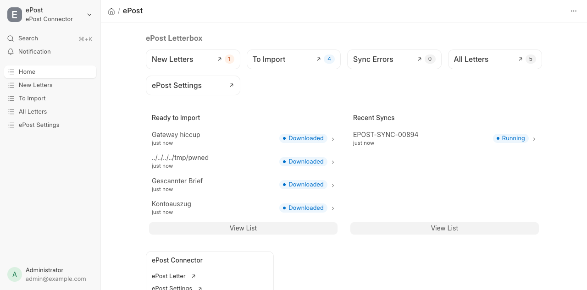
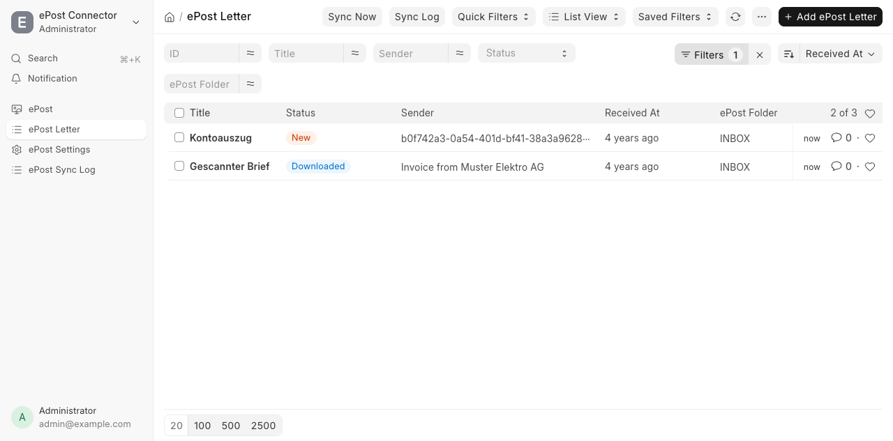
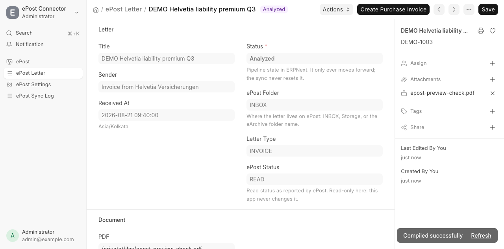
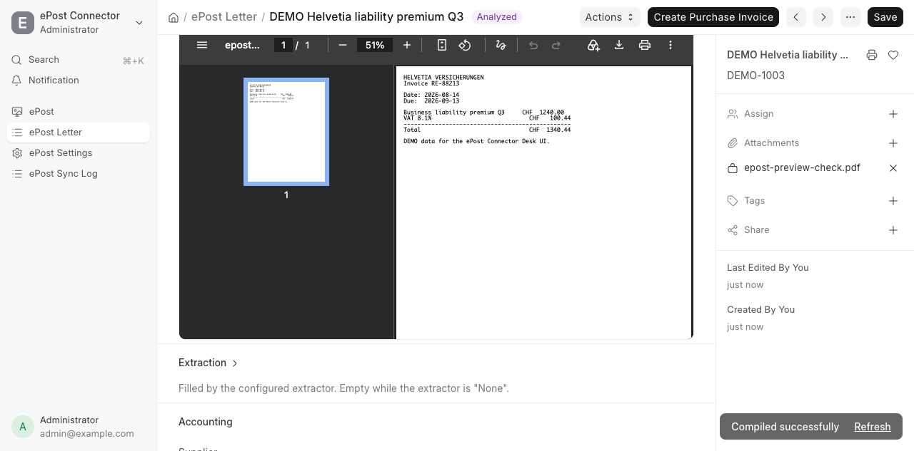
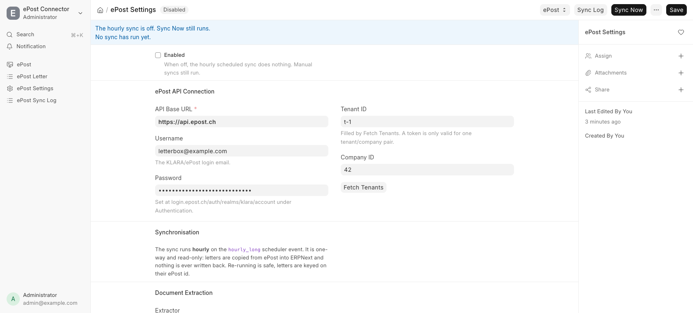

# ePost Connector

Syncs the 8gears ePost / Klara digital letterbox (Swiss Post, `api.epost.ch`) into
ERPNext. It lists received letters, downloads each PDF into a private Frappe File,
lets you filter, sort, tag and preview them in Desk, and creates **draft** Purchase
Invoices from them.

Frappe v16 / ERPNext v16, Python 3.14 (what Frappe v16 requires).

## The one rule: this app is read-only toward ePost

Another system may process the same letterbox in parallel (in our deployment an n8n workflow does) and
owns the letter lifecycle there. This app must never race it, so it never calls a
state-changing ePost endpoint: no `/read`, `/accept`, `/reject`, `/archive`,
`/restore`, no `DELETE`.

That is enforced in three places, not just documented:

- `epost/client.py` contains **no method** that would perform such a call.
- `ePostClient._guard_read_only` raises `ePostWriteAttempt` on any verb other than
  `GET` below `/epost/`. `POST` survives only for the two `/core/latest/` auth
  endpoints. It matches on the *resolved* URL, not on the path it was handed,
  because `urljoin` turns `epost/v2/…` and `//epost/v2/…` into the same endpoint.
- **Redirects are not followed.** `requests` follows one without consulting that
  guard, and 307/308 keep the verb *and* the body, so a redirected token `POST`
  would arrive below `/epost/` as a write carrying the password. A 3xx is
  reported as an error naming the `Location` instead.

**ePost is the source of truth. `ePost Letter` rows are copies.** The sync is
one-way and idempotent, keyed on the ePost letter id, so re-running converges
rather than duplicating.

## Architecture

```
ePost API (api.epost.ch)
	│  GET only — the inbox listing
	▼
epost/client.py ......... auth (X-API-KEY, or password + refresh grant),
	│                     pagination, retries, PDF validation,
	│                     credential redaction
	▼
epost/sync.py ........... upsert ePost Letter, download PDF -> private File,
	│                     write one ePost Sync Log per run.  Hourly, and on demand.
	▼
extraction/ ............. LetterExtractor interface + registry.
	│                     Ships NoopExtractor only; no LLM implementation.
	▼
epost/import_invoice.py . draft Purchase Invoice, never submitted.
```

Pipeline status on `ePost Letter`, which only ever moves forward:

`New` → `Downloaded` → `Analyzed` → `Imported` / `Ignored`

`Imported` and `Ignored` are terminal. The sync still refreshes their ePost
metadata but never touches their pipeline state, supplier, or extraction fields.

### The sync reads the inbox, and the inbox is the whole letterbox

One endpoint per run: `GET /epost/v2/letters`, paged to exhaustion.

There is no eArchive sweep. There was one, reading the Storage root and every
`GET /epost/v2/archives/directories` folder by id, and on this account it found
nothing at all. Surveyed live on 2026-09-01: all 217 letters are in the inbox,
the three real folders (`2021`, `Eingangsrechnungen 2021`, `Kreditoren`) hold
zero documents each, `GET /epost/v2/archives/letters` with no `directory-id`
answers with an empty array, and the only two directories reporting documents
(`ePost Scancenter` 187, `ePost Service AG` 30 — exactly the 217) have an empty
`directoryId` and so cannot be listed by id at all.

Putting it back needs new evidence from the account, not a reading of the spec.

### Two facts the spec gets wrong, and how the client handles them

The vendored spec and a working reference client against the live service
disagree in a few places. Where they do, the client accepts both rather than
picking a winner it cannot verify:

- **`offset` may or may not work.** The spec documents it (spec:11641-11651); the
  reference client never sends it and treats the listing as a fixed window. The
  client pages on `offset` and watches the ids coming back. If a full page
  contributes nothing new, `offset` is being ignored, and it says so with
  `ePostPaginationLimit` naming how many letters are reachable, instead of
  looping forever or silently truncating. The letters inside the window are still
  synced and the run is marked `Partial`, not `Failed`.
- **`/letters/inbox/count`** returns a bare integer per the spec and `{"count": n}`
  per the reference. Both are accepted.
- **Search** takes `value` per the spec and `keyword` per the reference. Both are
  sent.
- **The sender name** has no field in the `Letter` schema at all. In practice
  `description` carries it ("Invoice from …"), so that is read first.

### Downloaded bytes are validated before they are stored

The content endpoint has been observed answering `200` with a gateway HTML error
page, and with zero bytes. Both look like success to everything except an
inspection of the body, and either one stored under a letter's name is
indistinguishable from the letter afterwards. So a download is accepted only if
it is non-empty and contains `%PDF-` within its first kilobyte (searched rather
than anchored, so a byte-order mark is tolerated). On failure no File is created,
the letter keeps its metadata row, and the reason lands in `Sync Error`.

File names are derived from the letter id and a sanitised title, never from
service-supplied strings: Frappe builds the stored path from `file_name`, so a
value shaped like `../..` would otherwise decide where the file lands.

Credentials are stripped from error text before it reaches an `ePost Sync Log`
row or the Error Log, because an upstream gateway can quote the request that
produced the error back at you, Authorization header and all.

## Install

```bash
bench get-app epost_connector <repo-url>
bench --site <site> install-app epost_connector
bench --site <site> migrate
```

`erpnext` is a required app.

## Configuration

### 1. Get a credential

The API documents two independent security schemes, and either one is enough:

- **An API key**, sent as `X-API-KEY`. Issued in the ePost portal. This is the
  one to use if the account has **2FA** enabled, because 2FA makes the password
  grant fail outright and no password will get you in. A key needs no tenant, no
  token and no `/core/latest` call at all.
- **A username and password.** The Klara/ePost web login may use SSO, so the API
  needs a real password set on the account:
  `login.epost.ch/auth/realms/klara/account` → **Authentication** → set password.

Configured together, both are sent: the key on every request and the token
beside it. A grant that then fails is logged and the run carries on with the key.

### 2. Fill in ePost Settings

Desk → **ePost Settings** (or the ePost workspace):

| Field | Notes |
|---|---|
| `Enabled` | Off by default. When off the hourly job does nothing; manual syncs still run. |
| `API Base URL` | `https://api.epost.ch` |
| `API Key` | Sent as `X-API-KEY`. Takes precedence, and on its own is a complete credential — the fields below can then stay empty. Stored in Frappe's encrypted `__Auth` table. |
| `Username` / `Password` | The ePost login and the password from step 1. Optional when an API Key is set. Stored in Frappe's encrypted `__Auth` table. |
| `Tenant ID` / `Company ID` | Press **Fetch Tenants** after saving; needs the username and password, since the credentials are that call's body. One tenant fills them in, several open a picker. A token is only ever valid for one tenant/company pair. Not used by key-only auth. |
| `Extractor` | `None` by default. See *Extraction* below. |
| `Company`, `Default Item`, `Default Expense Account`, `Default Cost Center` | Purchase Invoice defaults. |

Press **Test Connection** to authenticate and read the unread count. It names
which scheme answered — *API key*, *password grant* or *both*. That is the only
"does it work" check that touches the live API, and it is a `GET`.

### 3. Sync

The sync runs **hourly** on the `hourly_long` scheduler event. `Sync Now` on the
settings form or the letter list enqueues a background run. Every run writes an
`ePost Sync Log` row with counts and per-letter errors; a run left at `Running`
means the worker died before finishing.

A letter that fails is rolled back to a savepoint, recorded on the log and on the
letter's `Sync Error` field, and the run continues.

## Using it

Everything is native Desk. There is no separate frontend to build or serve.

### The workspace



Shortcuts carry live counts, so **Sync Errors** reading anything but zero is the
one thing worth looking at on this page. **Ready to Import** lists the letters
waiting for a human; **Recent Syncs** is the last few runs.

### The letter list



Status is a coloured indicator: New is orange, Downloaded blue, Analyzed purple,
Imported green, Ignored grey. A letter whose last sync failed shows a red **Sync
Error** regardless of its status, because that is the one that needs a person.

`Received At` is shown as an age; hover for the timestamp. `Document Types`
carries the categories ePost put on the letter, lower-cased so that `Invoice`,
`INVOICE` and `invoice` are one value and one filter — it is a standard filter,
so "show me the invoices" is one click. Every row with a PDF gets a **PDF**
button that opens the scan without leaving the list.

There is deliberately **no `Amount` column**. The only extractor this app ships
is the no-op (see *Extraction* below), so in the shipped configuration every
letter's amount is `0` — and a Currency column cannot be empty, so those zeroes
render with a currency symbol taken from the site default. That is a
denomination nobody read off the document, on every row. Add the column under
**List Settings** once a real extractor is filling the field.

**Quick Filters** holds the views worth having: New Letters, To Import, Sync
Errors, Imported, Everything. The default view hides `Ignored` letters, and
*Everything* is how you get them back. Selecting letters and choosing **Mark as
Ignored** from the list Actions menu ignores them in bulk.

### A letter



One primary action at a time, whichever moves this letter forward: **Download
PDF** when there is no file yet, **Create Purchase Invoice** once there is, and
**Open Purchase Invoice** after it has been imported. **Analyze** and **Mark as
Ignored** live under *Actions*.

`Status` is read-only on the form. Every transition is a server decision except
*Ignored*, which is what the button is for. Ignoring is one-way: the pipeline
refuses to move a letter back out of `Ignored`, so there is deliberately no
un-ignore action.



The PDF is embedded in the form. It is a private file served only to a session
that may read it, so the preview is exactly as permissioned as the letter. When
the file is missing the preview says so and offers the download instead of
showing an empty frame.

Tagging is Frappe's native `_user_tags`: the tag area on the form and the Tags
filter in the list sidebar work with no configuration.

### Settings



The banner is the connection state: whether the hourly sync is on, and when the
last run was with its outcome and counts, read from the newest `ePost Sync Log`.
**Test Connection** authenticates and reads the unread count. **Sync Now**
queues a run and then links to the log it opens, or tells you the job never
started, which is what a stopped background worker looks like from the browser.

### The Purchase Invoice is a starting point

It is created as a draft and **never submitted**. Supplier comes from the dialog,
else the letter's `Supplier`, else a match of `vendor_name` / `sender_name`
against existing Suppliers (exact first, then normalised, ignoring case,
punctuation and legal-form suffixes). An ambiguous match is treated as no match
so you are asked rather than handed a guess.

One item line is created, using `Default Item` if set, otherwise a non-stock line
carrying the letter title. `bill_no`, `bill_date` and `due_date` are filled from
extraction fields when present, and the letter's PDF is linked to the invoice.
Amounts are `0` until an extractor fills them in.

A foreign currency is *not* applied to the draft, because a conversion rate is a
decision only a human can make; the detected currency is noted in `remarks`
instead.

## Extraction

`extraction/` defines the interface and ships **no working extractor**. The
default `NoopExtractor` returns `None`, so extraction fields stay empty and
letters stop at `Downloaded`.

To add one, for example an LLM-backed extractor:

1. Subclass `LetterExtractor` in `extraction/anthropic.py`, set `name`, implement
   `extract(self, letter_doc, pdf_bytes) -> ExtractionResult | None`.
2. Register it in `extraction/registry.py::EXTRACTORS` under a key, and add the
   same key to the `extractor` Select options on `ePost Settings`.

Nothing in the sync engine or the invoice importer changes. Results land in
read-only fields on the letter, so a wrong answer is visible and correctable by a
human before anything is booked.

## Parallel operation

This app runs **alongside** the existing systems; it replaces nothing.

- **Source of truth:** the ePost letterbox. ERPNext rows are copies.
- **Direction:** one-way, ePost → ERPNext. Nothing is written back, ever.
- **Any other system on the same letterbox keeps running, untouched.** This app does
  not mark letters read, so it does not change what that workflow sees.
- **How to stop:** untick `Enabled` in ePost Settings, or uninstall the app. Both
  leave ePost and the n8n workflow intact and authoritative. Nothing this app
  does is destructive toward ePost, so there is no unrecoverable state.

## Reconciliation

Prove the two sides agree, repeatedly, with a number:

```bash
bench --site <site> execute epost_connector.epost.sync.reconcile
```

Prints JSON:

```json
{
  "epost_letters": 412,
  "erpnext_letters": 412,
  "in_both": 412,
  "missing_in_erpnext": [],
  "missing_in_erpnext_count": 0,
  "extra_in_erpnext": [],
  "extra_in_erpnext_count": 0,
  "listing_truncated": null,
  "in_sync": true
}
```

It counts the same ground the sync covers — the inbox — so the two numbers are
comparable by construction.

`missing_in_erpnext` is the id set present in ePost but not here — run a sync.
`extra_in_erpnext` is present here but no longer in ePost, which normally means
the letter was deleted in ePost after we copied it; this app will not remove it.
`listing_truncated` is non-null when the service would not page past its window,
in which case the comparison was made against a partial listing and `in_sync` is
false regardless of the diffs — a clean diff over missing data is not agreement.
`in_sync` is the acceptance criterion.

## License

MIT

## Deployment

See [docs/INSTALL.md](docs/INSTALL.md) to install and configure the app, and
[SECURITY.md](SECURITY.md) for how credentials and downloaded documents are handled.

